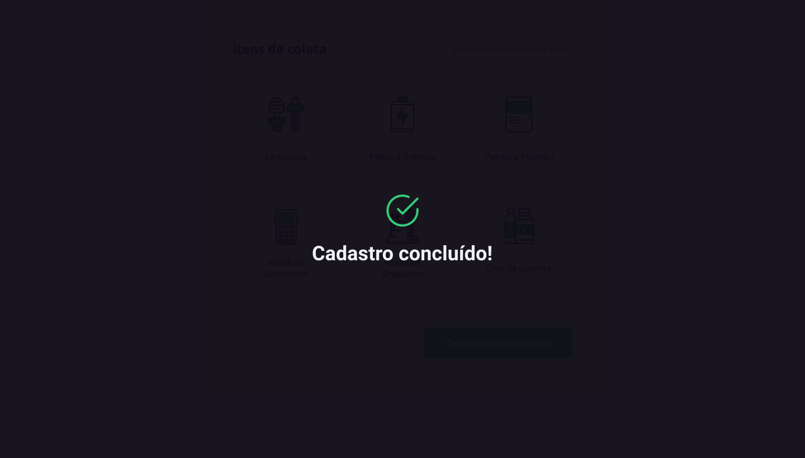

<h1 align="center">
    
</h1>

<h4 align="center"> 
	✔️NextLevelWeek 1.0✔️
</h4>


## 💻 Sobre o projeto

♻️ Ecoleta - é um marketplace que facilita o encontro entre entidades de coleta de residos orgânicos e inorgânicos


## 🎨 Layout

O layout da aplicação está disponível no <span href="https://www.figma.com/file/1SxgOMojOB2zYT0Mdk28lB/Ecoleta?node-id=136%3A546">Figma</span>

### Web

<p align="center" style="display: flex; align-items: flex-start; justify-content: center;">
  

  
</p>

## 🛠 Tecnologias

As seguintes ferramentas foram usadas na construção do projeto:

- [Node.js][nodejs]
- [Nunjucks][nj]
- [Express][express]
- [SQLite][sql]


## 🚀 Como executar o projeto


```bash
# Clone este repositório
$ git clone https://github.com/joao99sb/Ecoleta

# Instale as dependências
$ npm install

# Execute a aplicação em modo de desenvolvimento
$ npm start

# A aplicação será aberta na porta:3333 - acesse http://localhost:3333
```


## 😯 Como contribuir para o projeto

- Faça um fork desse repositório;
- Cria uma branch com a sua feature: `git checkout -b minha-feature`;
- Faça commit das suas alterações: `git commit -m 'feat: Minha nova feature'`;
- Faça push para a sua branch: `git push origin minha-feature`.
> Caso tenha alguma dúvida confira este [guia de como contribuir no GitHub](https://github.com/firstcontributions/first-contributions)


## 📝 Licença

Este projeto esta sobe a [LICENSE](LICENSE.md) MIT.

Made by Joao Victor Franca

[nodejs]: https://nodejs.org/
[reactjs]: https://reactjs.org
[nj]: https://mozilla.github.io/nunjucks/
[license]: https://opensource.org/licenses/MIT
[vceslint]: https://marketplace.visualstudio.com/items?itemName=dbaeumer.vscode-eslint
[prettier]: https://marketplace.visualstudio.com/items?itemName=esbenp.prettier-vscode
[rs]: https://rocketseat.com.br
[express]:https://expressjs.com/pt-br/
[sql]:https://www.sqlite.org/index.html